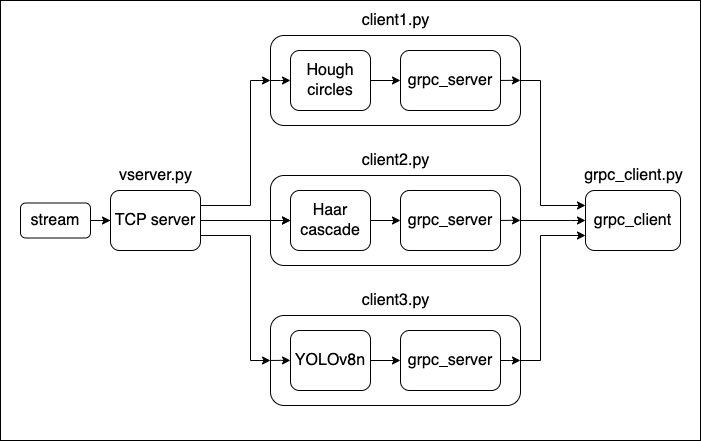

# Foucault pendulum tracking
Проект направлен на отслеживание и получение кинетических характеристик шара маятника Фуко в пространстве кадра на прямой трансялции доступной по [ссылке](http://pendelcam.kip.uni-heidelberg.de/mjpg/video.mjpg)


Реализация обнаружения шара от маятника производилась с помощью:
- Метода градиента Хафа [client1.py](#client1py)
- Каскада Хаара [client2.py](#client2py)
- Нейронной сети YOLOv8 [client3.py](#client3py)


## Схема


## Запуск:
```
python vserver.py
python client1.py  # classic cv
       client2.py  # Haar Cascade classifier
       client3.py  # YOLOv8n
python vserver.py  
```


## Реализация 
### [client1.py](https://github.com/mantesssa/foucault-pendulum-tracking/blob/main/fpt/client1.py)

1. Обрезаема изображение в области интереса
2. Конвертируем в оттенки серого
3. Выделяем движущиеся объекты (cv2.createBackgroundSubtractorMOG2())
4. Накладываем Размытие по Гаусу (cv2.GaussianBlur())
5. Ищем Круги Хафа (cv2.HoughCircles())
6. полученные координаты переводим в bbox 
7. Рисуем bbox и вектор
8. отправляем данные об обнаружении клиенту по grpc

### [client2.py](https://github.com/mantesssa/foucault-pendulum-tracking/blob/main/fpt/client2.py)

Обучение происходило на том же датасете что и нейронка. Позитивные образцы были собраны из ограничивающих рамок набора данных, негативные образцы были выбраны случайными картинками на изображениях из набора данных которые не пересекаются с bbox шара
Обучение длилось 10 этапов.
Количество положительных изображенией: 800.
количество негативных изображенией: 800.
Размер сэмпла: 24 x 24 пикселя.

1. Обрезаема изображение в области интереса
2. Конвертируем в оттенки серого
3. Ищем шар с помощью каскадов Хаара
4. Рисуем bbox и вектор
5. отправляем данные об обнаружении клиенту по grpc

### [client3.py](https://github.com/mantesssa/foucault-pendulum-tracking/blob/main/fpt/client3.py)

Для обучения нейронной сети использовался набор данных из размеченных кадров из стрима и составил 897 картинок.
Модель: YOLOv8n.
Обучение происходило на 400 эпохах.
Размер входного изображения 320 пикселя.
Размер батча = 64.

#### Результаты обучения:
Box(P=1, R=1, mAP50=0.995,  mAP50-95=0.838)


1. Обрезаема изображение в области интереса
2. Конвертируем в оттенки серого
3. Ищем шар с помощью YOLOv8n
4. Рисуем bbox и вектор
5. отправляем данные об обнаружении клиенту по grpc


